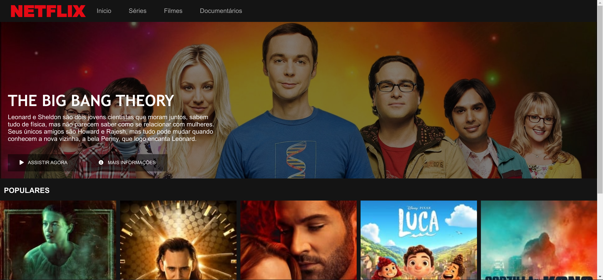

# Netflix Clone

This is a clone of the Netflix streaming service. It was done as a personal project when I started learning web development.

### HOW TO TRY IT

If you want to try this project on your machine, you can clone this repository:

```bash
  git clone https://github.com/keuwey/Clone-netflix.git
```
And then do:

```bash
  Enter the directory folder
  Click on index.html
```
## Screenshots


## Autor

- [@keuwey](https://www.github.com/keuwey)

